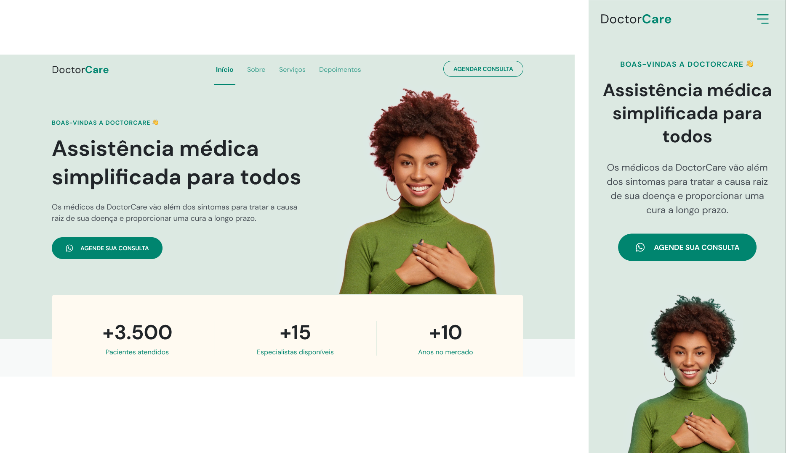

<h1 align="center"> Gabriel Oliveira </h1>

Projeto Desenvolvido para praticar as habilidades de tecnologias WEB - Responsivo

  <a href="#-tecnologias">Tecnologias</a>&nbsp;&nbsp;&nbsp;|&nbsp;&nbsp;&nbsp;
  <a href="#-projeto">Projeto</a>&nbsp;&nbsp;&nbsp;|&nbsp;&nbsp;&nbsp;
  <a href="#-layout">Layout</a>&nbsp;&nbsp;&nbsp;|&nbsp;&nbsp;&nbsp;
  <a href="#memo-licença">Licença</a>

  

 

 
  
  
   
   

 
 

## 🚀 Tecnologias

Esse projeto foi desenvolvido com as seguintes tecnologias:

- HTML e CSS
- JavaScript
- Git e Github
- Figma

 

## 💻 Projeto

O DoctorBiel é um projeto WEB SITE institucional para clinica DoctorBiel. Feito para apresentar a empresa, informar os seus serviços e promover a sua marca. Mesmo com as redes sociais, o site institucional é geralmente o primeiro canal que o usuário irá se informar sobre a sua marca.

 

## 🖼️ Design

Você pode acessar o projeto desenvolviso através do Figma clicando no link abaixo:

https://www.figma.com/file/D7lWNL5HkpmbHmTjRTVcsn/DoctorBiel-(Community)?node-id=0%3A1&t=9LjSx2nDELrXuWJn-1

 

## :memo: Licença
---

Feito com ♥ por Gabriel.

 
  
  
   
   

